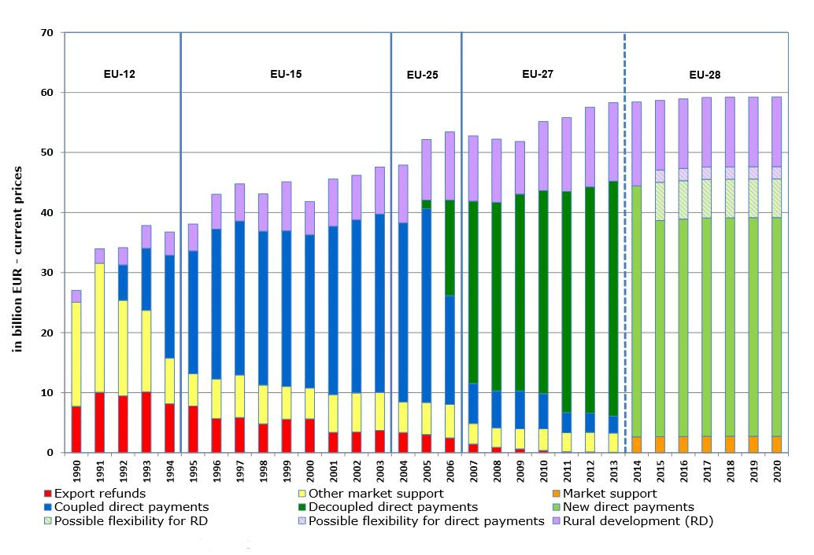
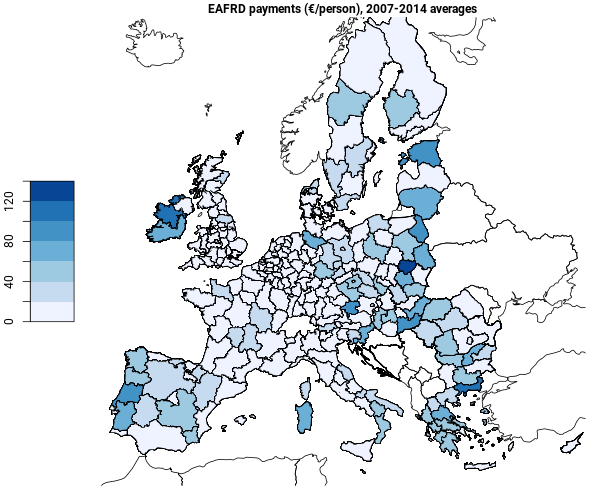
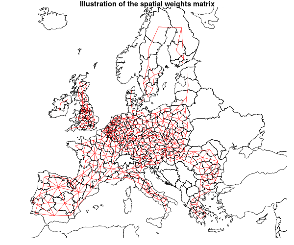
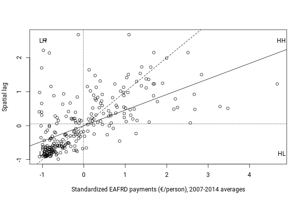
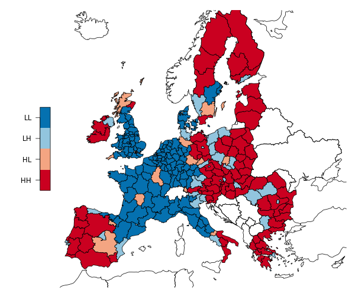
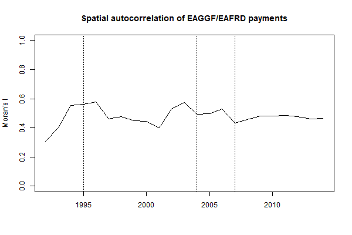
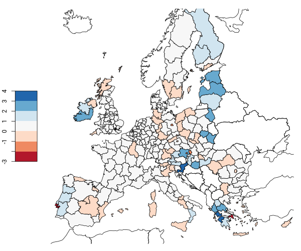
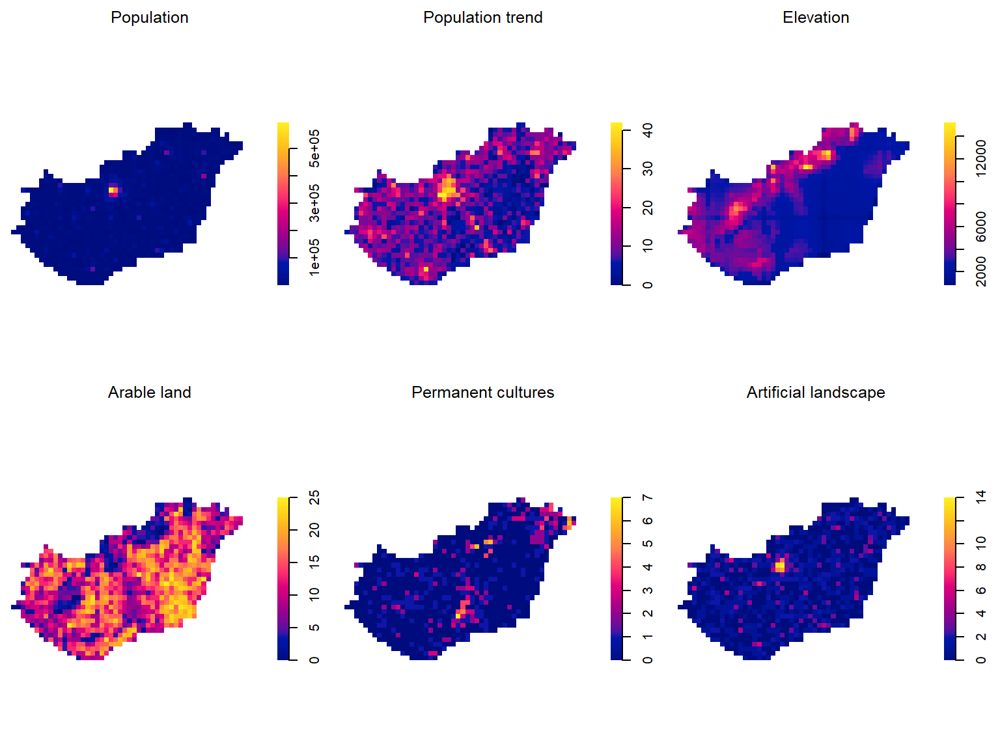

```{r setup, include=FALSE}
# Settings
knitr::opts_knit$set(include = T, eval = T, echo = F, message = F, warning = F, root.dir = '..')
```

## What is Common Agricultural Policy (CAP)?

Market measures, income support and rural development



<cite>@pushkarev_cap_2015</cite>

# Research problem

## Regional development

Regional development ~ rural development.

Uneven regional development is caused by 

- different productivity, 
- different transportation infrastructure, 
- technology and knowledge spillovers, 
- factor mobility (@dallerba_distribution_2005). 

## Rhetorics {.leftsmall}

Article 3. Mission

The EAFRD shall contribute to the Europe 2020 Strategy by promoting sustainable rural development throughout the Union in a manner that complements the other instruments of the CAP, the cohesion policy and the common fisheries policy. It shall contribute to the development of a Union agricultural sector that is more **territorially and environmentally balanced**, climate-friendly and resilient and competitive and innovative. It shall also contribute to the **development of rural territories**.

Article 4. Objectives

Within the overall framework of the CAP, support for rural development, including for activities in the food and non-food sector and in forestry, shall contribute to achieving the following objectives:

- fostering the competitiveness of agriculture;
- ensuring the sustainable management of natural resources, and climate action;
- achieving a **balanced territorial development of rural economies and communities** including the creation and maintenance of employment.

<cite>@european_parliament_and_council_of_the_european_union_regulation_2013-1</cite>

## Research {.left}

Territorial aspects have not been seriously considered in the policy design of the CAP nor Pillar 2 (@zasada_eus_2018).

The impact of rural development support of CAP on the well-being of regions in Hungary has been demonstrated to be insignificant (@bakucs_success_2019).

Regions that are less rural tend to have higher Pillar 2 expenditure intensity compared to more rural regions (@camaioni_how_2014).

Distribution of funds from other regional policies have stronger association with regional disadvantage compared to Pillar 2 (@crescenzi_tandem_2011).

## Distribution of EAFRD expenditure



<cite>@european_commission_historic_2019</cite>

---

The allocation principles of EAFRD expenditure are unclear. 

The mechanism of allocation is different on country, region and beneficiary level.

Hence, there's a lot of uncertainity and randomness. 

---

Which factors and how are correlated to the rural development expenditure?

## Expected correlations {.left}

*Fostering the competitiveness of agriculture*: small farming, agricultural employment  and investments.

*Ensuring the sustainable management of natural resources, and climate action*: organic farming.

*Achieving a balanced territorial development of rural economies and communities including the creation and maintenance of employment*: GDP, unemployment.

---

Correlation to other EU structural and investment funds. 

Spatial correlation between regions.

# Data and methods

## Data

Amount of payments to each NUTS2 region between 1993-2015 from EAGGF, EAFRD and some other EU structural and investment funds. 

Modelled yearly payments.

Other data on NUTS2 regions from Eurostat.

Expenditure per capita (€/person). 

## Spatial weights 



## Global indicator of spatial association {.left}

Moran's I is defined as

$$I = \frac{n}{\sum_{i=1}^{n} \sum_{j=1}^{n} w_{i,j}} \frac{\sum_{i=1}^{n} \sum_{j=1}^{n} w_{i,j}(x_i - \bar{x})(x_j - \bar{x})}{\sum_{j=1}^{n}(x_i - \bar{x})^2}.$$

<br>
In case of queen contiguity $n = {\sum_{i=1}^{n} \sum_{j=1}^{n} w_{i,j}}$, thus Moran's I is
$$I = \frac{\sum_{i=1}^{n} \sum_{j=1}^{n} w_{i,j}(x_i - \bar{x})(x_j - \bar{x})}{\sum_{j=1}^{n}(x_i - \bar{x})^2}.$$

## Local indicator of spatial association (LISA) {.left}

First defined by @anselin_local_1995 as

$$I_i = \frac{(x_i - \bar{x})}{(x_i - \bar{x})^2/n}\sum_{j}w_{i,j}(x_j - \bar{x}).$$

## Pearson's correlation coefficient {.left}

The direction of causality is unclear and theoretically multidirectional.

$$r = \frac{\sum_{i=1}^{n}(x_i-\bar{x})(y_i-\bar{y})}{\sum_{i=1}^{n}(x_i-\bar{x})^2 \sum_{i=1}^{n}(y_i-\bar{y})^2}$$

# Results

## Global spatial autocorrelation {.left}

```{r, echo = F}
readLines('results/moransi.txt')
```

Higher than the 0.201 estimated by @crescenzi_tandem_2011.

---



---



---



No negative trend as demonstrated by @crescenzi_tandem_2011.

## Local spatial autocorrelation



## Correlations with regional characteristics

```{r, , echo = F}
htmltools::includeHTML("results/cor_vars.html")
```

## Correlations with other EU regional and investment funds

```{r, , echo = F}
htmltools::includeHTML("results/cor_funds.html")
```

# Conclusions

---

Level of territorial aggregation may have a substantial impact on the results.

The concentration of expenditure is rather high at NUTS2 level.

There is no clear temporal trend in the concentration of expenditure.

---

The expenditure is positively correlated with relative GDP but not to unemployment.

Correlation between the expenditure and small farming, agricultural employment and investments has increased whereas it has weakened with organic production.

Other structural and investment funds of the EU are strongly correlated with the expenditure.

---

It has not been demonstrated that more support would lead to higher economic development. 

So why the payments for rural development?

Is Pillar 2 an instrument to compensate for unequal Pillar 1 payments?

## Further research

Explaining the distribution instead of decribing it.

Expenditure form Pillar 1 and Member State co-financing.

Account for various differences between regions.

---




# That's all!

For details see [github.com/lillemets/19_uppsala](https://github.com/lillemets/19_uppsala)

# References 

---
